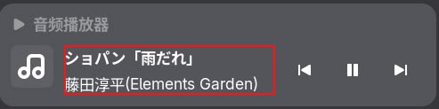

Read [patch.py](./patch.py) for what it modifies in the font files -- it's very easy.

Use [experimental-scripts/info.py](../experimental-scripts/info.py) to see the font info before and after patching.

Comparison:

(Original, note that text and icon are not properly aligned)

(Patched)
